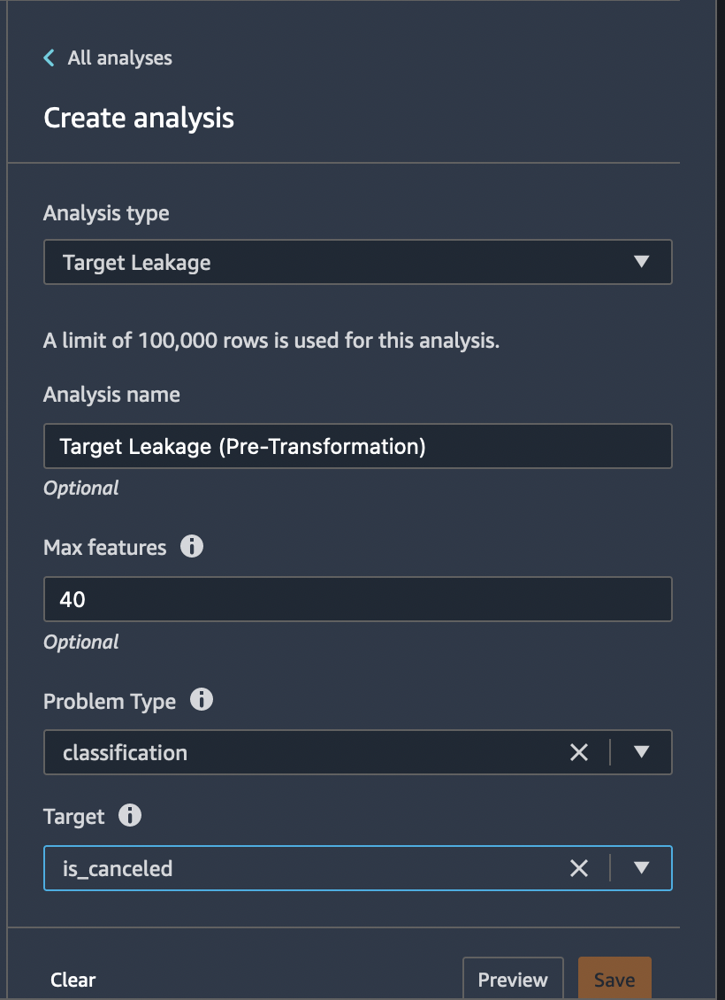
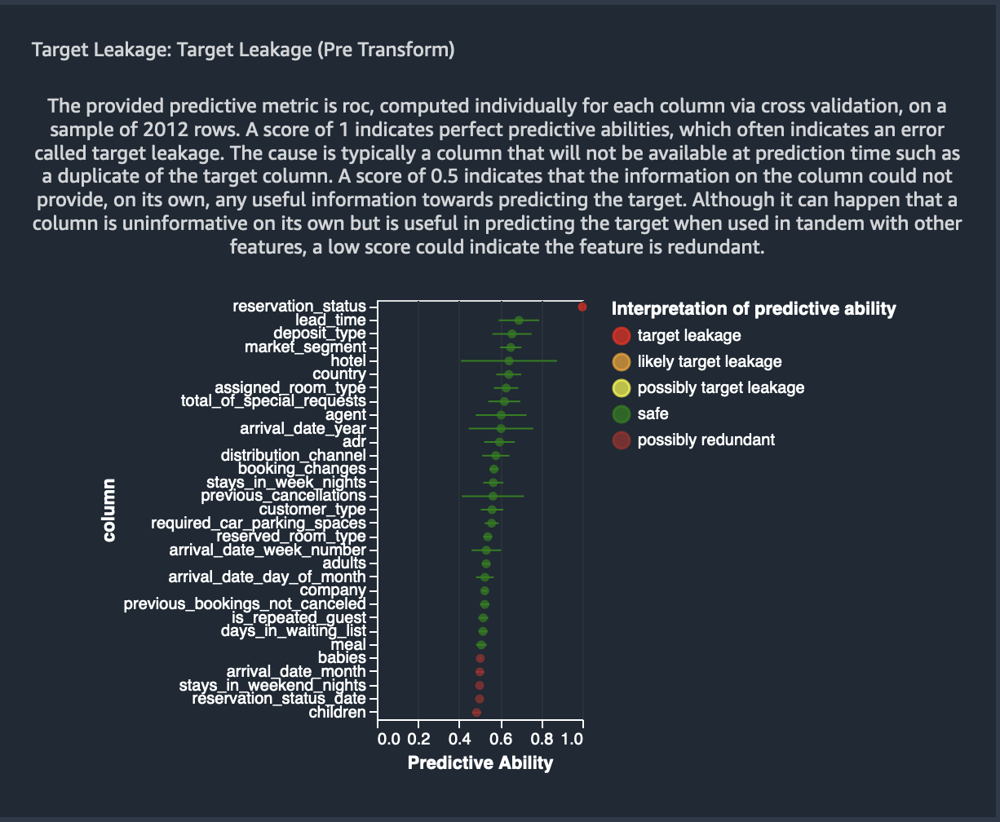
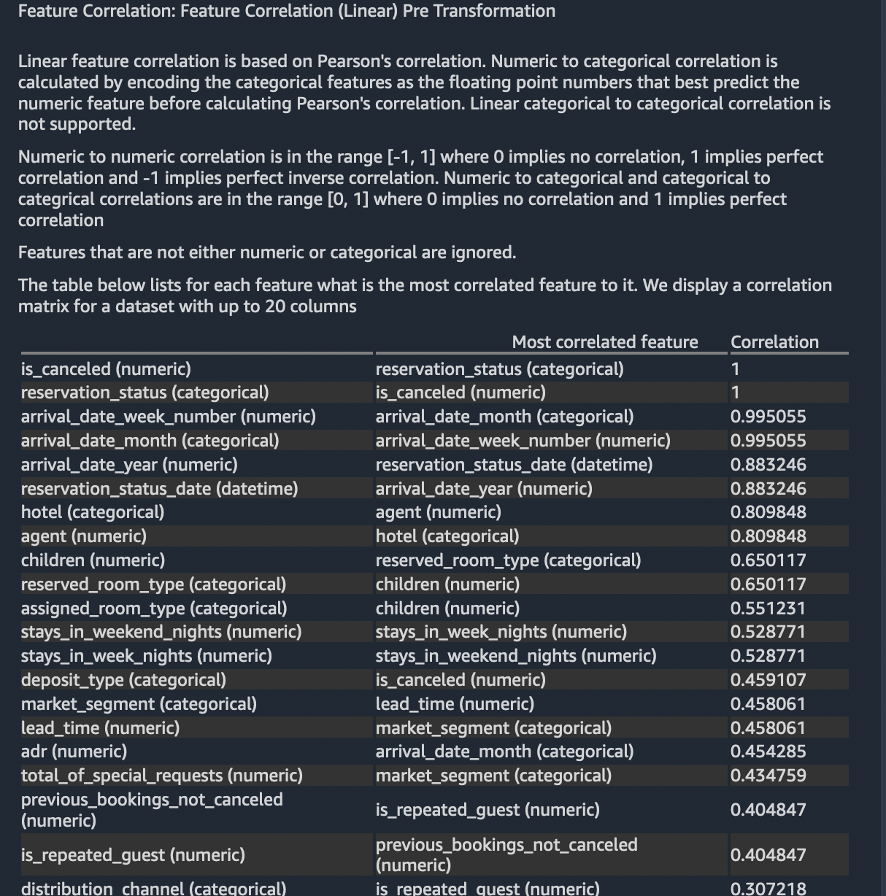
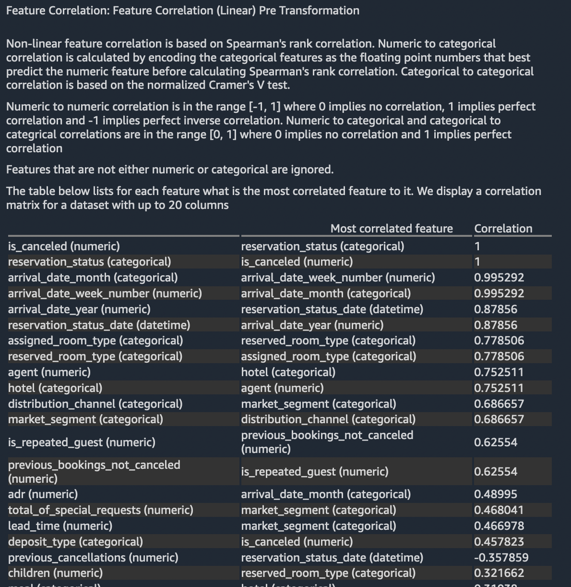
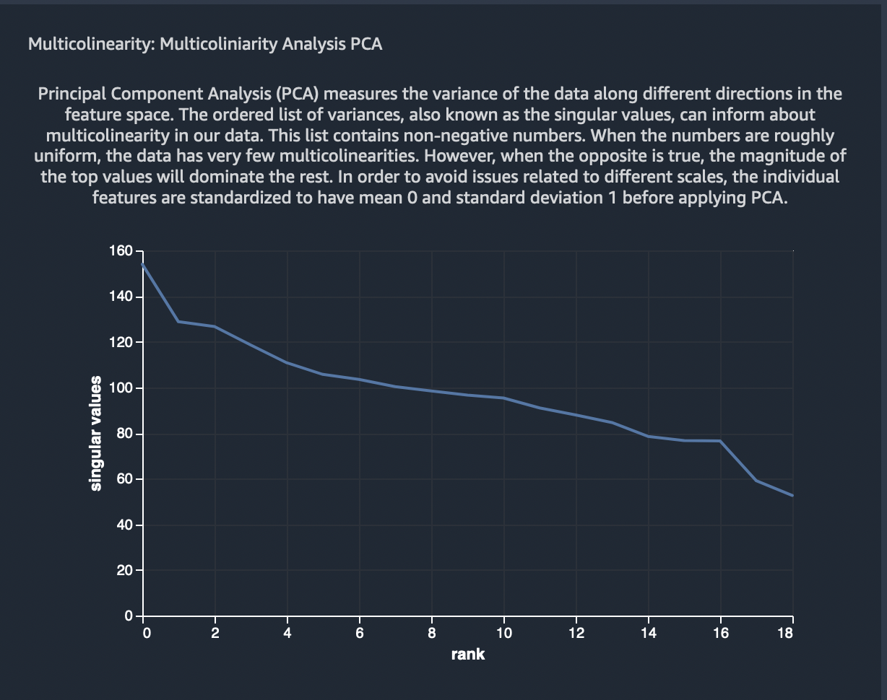
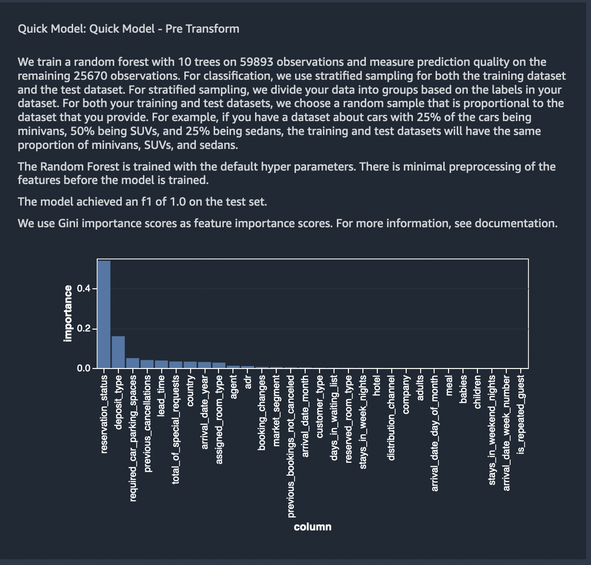

## Exploratory Data Analysis 

### Analyze and Visualize 

Amazon SageMaker Data Wrangler includes built-in analyses that help you generate visualizations and data analyses in a few clicks. You can also create custom analyses using your own code.

For EDA, let's choose the Add Analysis option - this takes us to the analysis page (see below) where we are provided with a list of various analysis types to choose and apply.

To access an analysis you've created, select the step that contains the analysis, and select the analysis.

Before we transform our raw features to make it ML ready for model building, lets analyze and visualize the booking cancellations dataset to detect features that are important to our problem and ones that are not. 

All analyses are generated using 100,000 rows of your dataset.

You can add the following analysis to a dataframe:

* Data visualizations, including histograms and scatter plots.
* A quick summary of your dataset, including number of entries, minimum and maximum values (for numeric data), and most and least frequent categories (for categorical data).
* A quick model of the dataset, which can be used to generate an importance score for each feature.
* A target leakage report, which you can use to determine if one or more features are strongly correlated with your target feature. 
* A custom visualization using your own code.

Following sections showcase few of the analysis techniques for the Hotel-bookings data.

### Target Leakage 

Target leakage occurs when there is data in a machine learning training dataset that is strongly correlated with the target label, but is not available in real-world data. For example, you may have a column in your dataset that serves as a proxy for the column you want to predict with your model.

When you use the Target Leakage analysis, you specify the following:
* **Target**: This is the feature about which you want your ML model to be able to make predictions.
* **Problem type**: This is the ML problem type on which you are working. Problem type can either be classification or regression.
* (Optional) **Max features**: This is the maximum number of features to present in the visualization, which shows features ranked by their risk of being target leakage.

For classification, the target leakage analysis uses the area under the receiver operating characteristic, or AUC - ROC curve for each column, up to Max features. For regression, it uses a coefficient of determination, or R2 metric.

The AUC - ROC curve provides a predictive metric, computed individually for each column using cross-validation, on a sample of up to around 1000 rows. A score of 1 indicates perfect predictive abilities, which often indicates target leakage. A score of 0.5 or lower indicates that the information on the column could not provide, on its own, any useful information towards predicting the target. Although it can happen that a column is uninformative on its own but is useful in predicting the target when used in tandem with other features, a low score could indicate the feature is redundant.

To create a target leakage analysis, use the following configuration (as shown in the figure below). 

For our example dataset, the image below shows a target leakage report for a hotel booking cancellation problem, that is, predicting if a person will cancel his hotel reservation or not. An AUC - ROC curve is used to calculate the predictive ability of 31 raw features, out of which `reservation_status` was determined to a target leakage. Also, features - `arrival_day_of_month`, `babies`, `reservation_status_date`, `arrival_date_month`, `reserved_room_type`, `hotel` and `days_in_waiting_list` were identified as redundant.

The identified features can be fairly omitted as part of the transformations we will apply post this initial analysis.

Next, with SageMaker Data Wrangler’s feature correlation visualization you can easily calculate the correlation of features in your data set and visualize them as a correlation matrix. We will look into 2 types of feature correlations and how to use them on our example dataset in hand.

### Feature Correlation (Linear)

Linear feature correlation is based on Pearson's correlation. Numeric to categorical correlation is calculated by encoding the categorical features as the floating point numbers that best predict the numeric feature before calculating Pearson's correlation. Linear categorical to categorical correlation is not supported.

Numeric to numeric correlation is in the range [-1, 1] where 0 implies no correlation, 1 implies perfect correlation and -1 implies perfect inverse correlation. Numeric to categorical and categorical to categrical correlations are in the range [0, 1] where 0 implies no correlation and 1 implies perfect correlation. Features that are not either numeric or categorical are ignored. The table below lists for each feature what is the most correlated feature to it. 

Based on the correlation values, we can see the top 6 feature pairs (as listed below) are strongly correlating with one another. Also, some of these features also showed up in the target analysis we did previously.

P.S.: A limit of 100,000 rows is used for this analysis.

### Feature Correlation (Non-Linear)

Non-linear feature correlation is based on Spearman's rank correlation. Numeric to categorical correlation is calculated by encoding the categorical features as the floating point numbers that best predict the numeric feature before calculating Spearman's rank correlation. Categorical to categorical correlation is based on the normalized Cramer's V test.

Numeric to numeric correlation is in the range [-1, 1] where 0 implies no correlation, 1 implies perfect correlation and -1 implies perfect inverse correlation. Numeric to categorical and categorical to categrical correlations are in the range [0, 1] where 0 implies no correlation and 1 implies perfect correlation

Features that are not either numeric or categorical are ignored.

The table below lists for each feature what is the most correlated feature to it. You can see most of the top correlated feature pairs overlap with the previous two analyses.
    

### Multicolinearity (Variance Inflation Factors)

Variance Inflation Factor (VIF) is a measure of colinearity among variables. It is calculated by solving a regression problem to predict one variable given the rest. A VIF score is a positive number that is greater or equal than 1, and a score of 1 means the variable is completely independent of the others. The larger the score, the more dependent it is. Since it is an inverse, it is possible for the VIF score to be infinite. Note that we cap the VIF score at 50. As a rule of thumb for cases where the number of samples is not abnormally small, a score of up to 5 means the variable is only moderatly correlated, and beyond 5 it is highly correlated.

As per the above rule, we can eliminate the following feature columns from our feature set since they will not contribute effectively towards the prediction capability of the model that gets trained using these features.

* `arrival_date_year`
* `adults`, `agents`
* `arrival_date_week_number`
* `stays_in_week_nights`

### Multicolinearity - Principal Component Analysis (PCA)

Principal Component Analysis (PCA) measures the variance of the data along different directions in the feature space. The ordered list of variances, also known as the singular values, can inform about multicolinearity in our data. This list contains non-negative numbers. When the numbers are roughly uniform, the data has very few multicolinearities. However, when the opposite is true, the magnitude of the top values will dominate the rest. In order to avoid issues related to different scales, the individual features are standardized to have mean 0 and standard deviation 1 before applying PCA.

As per the above rule, it is evident the numbers (variances) are not uniform hence confirming that the data has multicolinearies to fix. This has already been confirmed by our previous analysis.

### Multicolinearity Lasso Feature Selection 

Lasso feature selection trains a linear classifier with L1 regularization (you can control the strength of L1 penalty by adjusting "L1 magnitude") that induces a sparse solution. The regressor provides a coefficient for each feature, and the absolute value of this coefficient could be interpreted as an importance score for that feature.

The plot below provides features' importance scores (absolute coefficients) after training a classifier on a sample of the dataset (10k for large dataset). The training process includes a standardization of the features to have mean 0 and standard deviation 1 in order to avoid a skewed importance score due to different scales.
 
The classifier obtained a roc_auc score: `0.639269142214666`.

### Detect Duplicate Rows
Next, with the new duplicate row detection visualization, you can quickly detect if your data set has any duplicate rows. We can see almost ~28% of the rows in the dataset are duplicates. 

### Quick Model

Finally, let us create a quick model using the raw features to determine how good are our features and if this is something that is reliable, given we haven't dealt with the colinearlity issues with our dataset as yet based on previous analyses.

Use the Quick Model visualization to quickly evaluate your data and produce importance scores for each feature. A feature importance score indicates how useful a feature is at predicting a target label. The feature importance score is between [0, 1] and a higher number indicates that the feature is more important to the whole dataset. On the top of the quick model chart, there is a model score. A classification problem shows an F1 score. A regression problem has a mean squared error (MSE) score.

When you create a quick model chart, you select a dataset you want evaluated, and a target label against which you want feature importance to be compared. Data Wrangler does the following:
* Infers the data types for the target label and each feature in the dataset selected.
* Determines the problem type. Based on the number of distinct values in the label column, Data Wrangler determines if this is a regression or classification problem type. Data Wrangler sets a categorical threshold to 100. If there are more than 100 distinct values in the label column, Data Wrangler classifies it as a regression problem; otherwise, it is classified as a classification problem.
* Pre-processes features and label data for training. The algorithm used requires encoding features to vector type and encoding labels to double type.
* Trains a random forest algorithm with 70% of data. Spark’s RandomForestRegressor is used to train a model for regression problems. The RandomForestClassifier is used to train a model for classification problems.
* Evaluates a random forest model with the remaining 30% of data. Data Wrangler evaluates classification models using an F1 score and evaluates regression models using an MSE (mean squared error) score.
* Calculates feature importance for each feature using the Gini importance method.

Let us create a prediction model on the fly for the problem for the booking cancellation problem using the raw crude features we started with in Data Wrangler's Quick Model option.

A limit of 100,000 rows is used for this analysis. You can use the Quick Model feature to provide a rough estimate of the expected predicted quality and the predictive power of the features in your dataset. 

We can from the results below, Quick model was able to predict with an F1 score of 82% on the test set. But, this is misleading, given we haven't eliminated most of the feature columns that are a target leakage or redundant based on high colinearity. This is justified in the results below where the column `reservation_status` which is a target leakage ranked as the most important feature.

In the next section, we will apply some post analysis transformations to fix the data of the various colinearity and other issues and re-generate a quick model and compare the differences.
