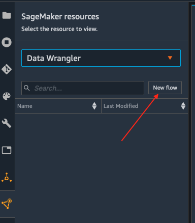
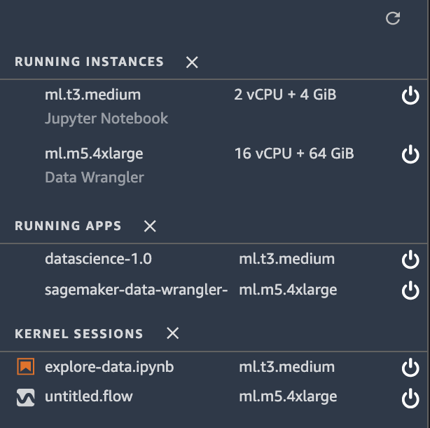

# Importing Dataset into Data Wrangler using SageMaker Studio

Following steps outline how to import data into Sagemaker to be consumed by Data Wrangler

* Steps to import data  
1. Initialize SageMaker Data Wrangler via SageMaker Studio UI. You can use any one of the options specified below. 
    - 

           
Option 1

           
 Use the Sage Maker Launcher screen as depicted here:
           

                    
    

    -  Opt1.- There are three ways that you can do this, 
    -  Opt 2 -  You can use the SageMaker resources menu on the left, selecting Data Wrangler, and new flow
    
    
    -  Opt 3 - You can also use the File -> New -> DataWrangler option as shown here
    
2. Data Wrangler takes a few minutes to load.

3. Once Data Wrangler is loaded, you should be able to see it under running instances and apps as shown below.

4. Once Data Wrangler is up and running, you can see the following data flow interface with options for import, creating data flows and export as shown below.

5. Make sure to rename the untitled.flow to your preference (for e.g., hotel-bookings.flow)
6. Paste the S3 URL for the hotel-bookings.csv file into the search box below and hit go.

7. Select the CSV file from the drop down results. On the right pane, make sure COMMA is chosen as the delimiter and Sampling is *None*. Hit *import* to import this dataset to Data Wrangler.

8. Once the dataset is imported, the Data flow interface looks as shown below.

9. Since currently you are in the data flow tab, hit the import tab (left of data flow tab) as seen in the above image.
