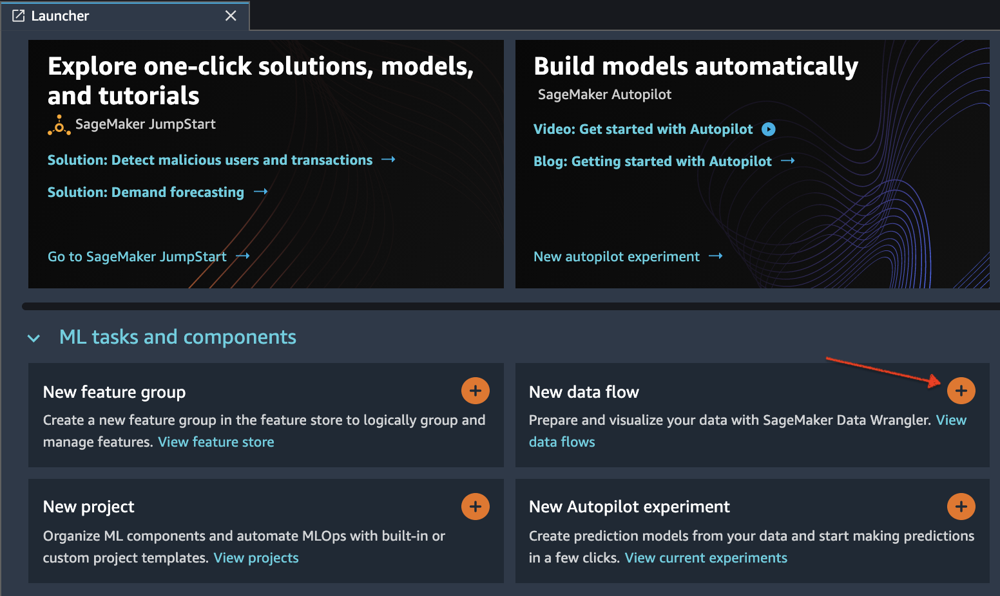

# Importing dataset into Sagemaker
Following steps outline how to import data into Sagemaker to be consumed by Datawrangler

* Initialize SageMaker Data Wrangler via SageMaker Studio UI.
    * There are three ways that you can do this, either from the Launcher screen as depicted here:
    
    * Or from the SageMaker resources menu on the left, selecting Data Wrangler, and new flow
    
    
    * You can also use the File -> New -> DataWrangler option as shown here
    
* It takes a few minutes to load.

* Once Data Wrangler is loaded, you should be able to see it under running instances and apps as shown below.

* Once Data Wrangler is up and running, you can see the following data flow interface with options for import, creating data flows and export as shown below.

* Make sure to rename the untitled.flow to your preference (for e.g., join.flow)
* Paste the S3 URL for the tracks.csv file into the search box below and hit go.

* Select the CSV file from the drop down results. On the right pane, make sure COMMA is chosen as the delimiter and Sampling is *None*. Hit *import* to import this dataset to Data Wrangler.

* Once the dataset is imported, the Data flow interface looks as shown below.

* Since currently you are in the data flow tab, hit the import tab (left of data flow tab) as seen in the above image.
* Import the second part file (ratings.csv) following the same set of instructions as noted previously.

