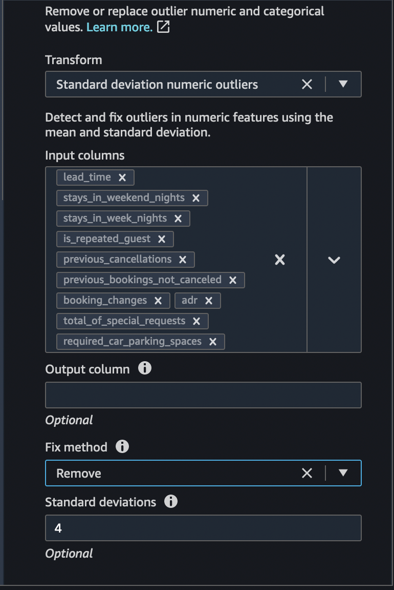
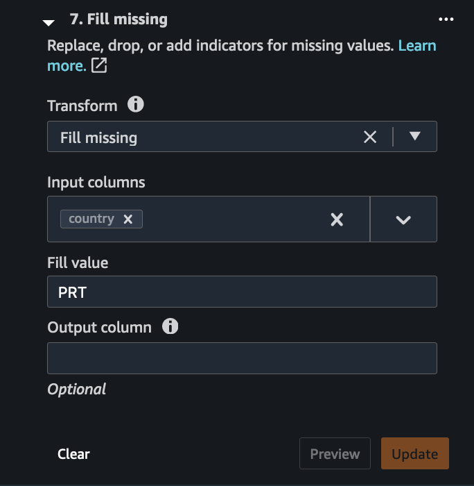
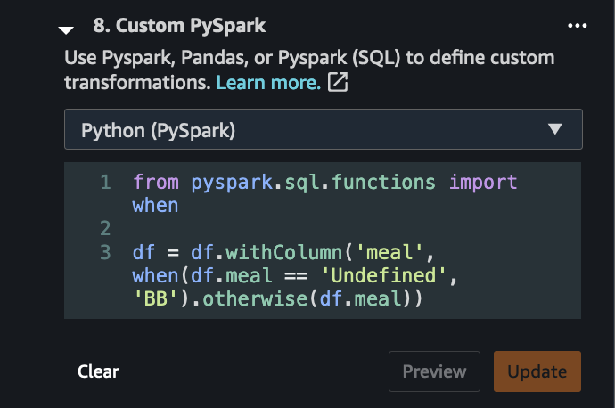
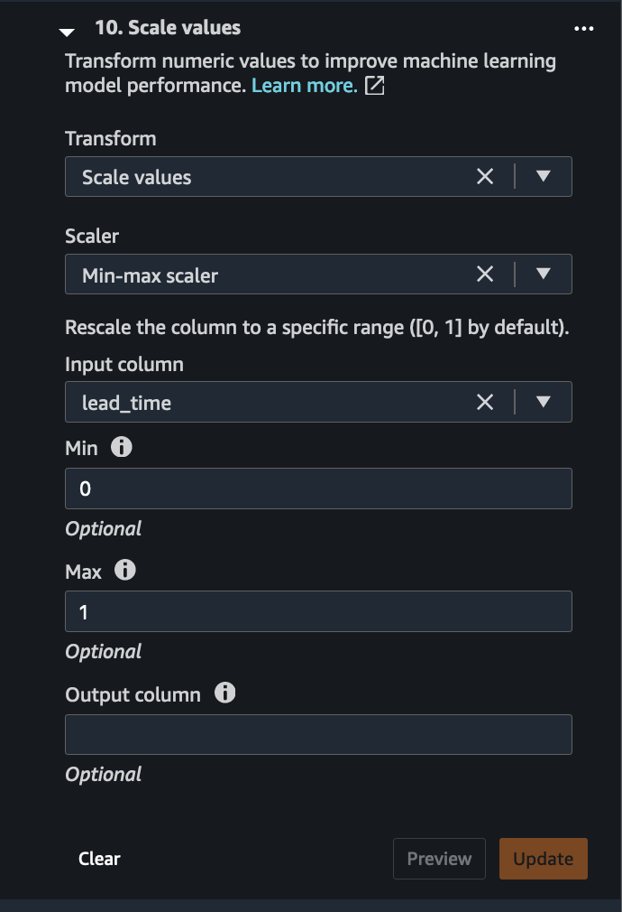
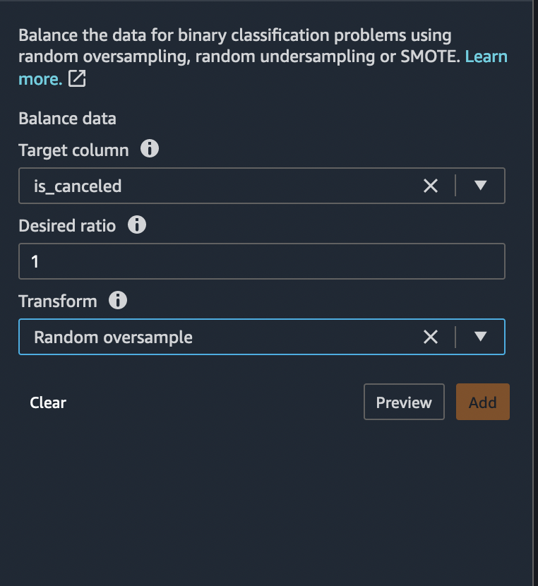

# Hotel Booking Demand Example
The example 


## Background

Amazon SageMaker helps data scientists and developers to prepare, build, train, and deploy machine learning models quickly by bringing together a broad set of purpose-built capabilities. This example shows how SageMaker can accelerate machine learning development during the data preprocessing stage to help process the hotel demand data and find relevant features for the training model to predict hotel cancellations. 

### Dataset

<div class="alert alert-block alert-info">
<b>Dataset</b>

We will be using the [Hotel Booking Demand dataset](https://www.kaggle.com/jessemostipak/hotel-booking-demand) that is publically available. This data set contains booking information for a city hotel and a resort hotel, and includes information such as when the booking was made, length of stay, the number of adults, children, and/or babies, and the number of available parking spaces, among other things. <br> <br>

The data needs to be downloaded from the locations specified, and uploaded to S3 bucket before we start the Data Preprocessing phase. Please follow the Experiment Steps  outlined in later sections, to download the data and notebooks.   


## Description of the Columns 


| Column Name  | Description  | 
|---|---|
| `hotel`  | Type of the hotel (`H1` = Resort Hotel or `H2` = City Hotel)  |   
| `is_canceled` | Value indicating if the booking was canceled (1) or not (0) |   
| `lead_time` | Number of days that elapsed between the entering date of the booking into the PMS and the arrival date |
| `arrival_date_year` | Year of arrival date |
| `arrival_date_month` | Month of arrival date |
| `arrival_date_week_number` | Week number of year for arrival date |
| `arrival_date_day_of_month` | Day of arrival date |
| `stays_in_weekend_nights` | Number of weekend nights (Saturday or Sunday) the guest stayed or booked to stay at the hotel |
| `stays_in_week_nights` | Number of week nights (Monday to Friday) the guest stayed or booked to stay at the hotel |
| `adults` | Number of adults |
| `children` | Number of children |
| `babies` | Number of babies |
| `meal` | Type of meal booked. Categories are presented in standard hospitality meal packages: `Undefined/SC` – no meal package; `BB` – Bed & Breakfast; `HB` – Half board (breakfast and one other meal – usually dinner); `FB` – Full board (breakfast, lunch and dinner) |
| `country`| Country of origin. Categories are represented in the `ISO 3155–3:2013` format |
|`market_segment`|Market segment designation. In categories, the term `TA` means “Travel Agents” and `TO` means “Tour Operators”|
|`distribution_channel`|Booking distribution channel. The term `TA` means “Travel Agents” and `TO` means “Tour Operators”|
|`is_repeated_guest`|Value indicating if the booking name was from a repeated guest (1) or not (0)|
|`previous_cancellations`|Number of previous bookings that were cancelled by the customer prior to the current booking|
|`previous_bookings_not_canceled`|Number of previous bookings not cancelled by the customer prior to the current booking|
|`reserved_room_type`|Code of room type reserved. Code is presented instead of designation for anonymity reasons.|
|`assigned_room_type`|Code for the type of room assigned to the booking. Sometimes the assigned room type differs from the reserved room type due to hotel operation reasons (e.g. overbooking) or by customer request. Code is presented instead of designation for anonymity reasons.|
|`booking_changes`|Number of changes/amendments made to the booking from the moment the booking was entered on the PMS until the moment of check-in or cancellation|
|`deposit_type`|Indication on if the customer made a deposit to guarantee the booking. This variable can assume three categories: No Deposit – no deposit was made; `Non Refund` – a deposit was made in the value of the total stay cost; `Refundable` – a deposit was made with a value under the total cost of stay.|
|`agent`|ID of the travel agency that made the booking|
|`company`|ID of the company/entity that made the booking or responsible for paying the booking. ID is presented instead of designation for anonymity reasons|
|`days_in_waiting_list`|Number of days the booking was in the waiting list before it was confirmed to the customer|
|`customer_type`|Type of booking, assuming one of four categories: `Contract` - when the booking has an allotment or other type of contract associated to it; `Group` – when the booking is associated to a group; `Transient` – when the booking is not part of a group or contract, and is not associated to other transient booking; `Transient-party` – when the booking is transient, but is associated to at least other transient booking|
|`adr`|Average Daily Rate as defined by dividing the sum of all lodging transactions by the total number of staying nights|
|`required_car_parking_spaces`|Number of car parking spaces required by the customer|
|`total_of_special_requests`|Number of special requests made by the customer (e.g. twin bed or high floor)|
|`reservation_status`|Reservation last status, assuming one of three categories: `Canceled` – booking was canceled by the customer; `Check-Out` – customer has checked in but already departed; `No-Show` – customer did not check-in and did inform the hotel of the reason why|
|`reservation_status_date`|Date at which the last status was set. This variable can be used in conjunction with the ReservationStatus to understand when was the booking canceled or when did the customer checked-out of the hotel|

---

## Pre-requisites:

  * We need to ensure dataset (tracks and ratings dataset) for ML is uploaded to a data source (instructions to download the dataset to Amazon S3 is available in the following section). 
  * Data source can be any one of the following options:
       * S3
       * Athena
       * RedShift
       * SnowFlake
       
       
<div class="alert alert-block alert-info">
<b>Data Source</b>

For this experiment the Data Source will be [Amazon S3](https://aws.amazon.com/s3/)

</div>

## Experiment steps

### Downloading the dataset 

* Ensure that you have a working [Amazon SageMaker Studio](https://aws.amazon.com/sagemaker/studio/) environment and that it has been updated.

* Follow the steps below to download the dataset.
1. Download the [Hotel Booking Demand dataset](https://www.kaggle.com/jessemostipak/hotel-booking-demand) from the specified location. 
2. Create a private S3 bucket to upload the dataset in. You can reference the instructions for bucket creaiton [here] https://docs.aws.amazon.com/AmazonS3/latest/userguide/create-bucket-overview.html
3.  Upload the data in step 1 to the bucket created in step 2. Steps to upload the data can be found [here] https://docs.aws.amazon.com/AmazonS3/latest/userguide/upload-objects.html
4. Note the S3 URL for the file uploaded in Step 3 before moving to the next sextion. This data will be used as input to the Datawrangler during the data preprocessing.

## Importing Datasets from a data source (S3) to Data Wrangler
The hotel-bookings.csv file uploaded in rpevious section needs to be imported in Data Wrangler as input. Please refer to **[Importing Dataset from S3](/Data-Import.md)** and follow steps for importing the data.

### Exploring Data
Before applying various data transformations, we need to explore the data to find correlation and target leakage. Please refer to **[Exploratory Data Analysis](/Data-Exploration.md)** and follow steps on Data exploration.

### Data Transformation 
Based on the Data explorations carried out in previous step, we are now ready to apply transformations to the data. 
Amazon SageMaker Data Wrangler provides numerous ML data transforms to streamline cleaning, transforming, and featurizing your data. When you add a transform, it adds a step to the data flow. Each transform you add modifies your dataset and produces a new dataframe. All subsequent transforms apply to the resulting dataframe.

Data Wrangler includes built-in transforms, which you can use to transform columns without any code. You can also add custom transformations using PySpark, Pandas, and PySpark SQL. Some transforms operate in place, while others create a new output column in your dataset.

#### Drop Columns 
 Now we will drop columns based on the analyses we performed in the previous section. 

-  based on target leakage : drop `reservation_status`

- redundant columns : drop columns that are redundant - `days_in_waiting_list`, `hotel`, `reserved_room_type`, `arrival_date_month`, `reservation_status_date`, `babies` and `arrival_date_day_of_month`

- based on linear correlation results : drop columns `arrival_date_week_number`, `arrival_date_year` as correlation values for these feature (column) pairs are greater than the recommended threshold of 0.90. 

- based on non-linear correlation results: drop `reservation_status`. This column was already marked to be dropped based on Target leakage analysis. 
 
 we can drop all these columns in one go. To drop columns, we can choose the **Drop column** transform and pick the column names we want to drop as show in the image below.
 
 
 
 
Further, based on the multi-colinearity analysis results, we can also drop the columns `adults` and `agent` for whom the variance inflation factor scores are greater than 5.


 

#### Drop Duplicate Rows
To drop the duplicate rows that we identified based on the analysis we did in the previous section. Choose **Drop duplicates** transform from the list of transforms available in Data Wrangler as shown in the figure below.

 

 
 
### Handle Outliers 
An outlier can cause serious problems in statistical analysis. Machine learning models are sensitive to the distribution and range of feature values. Outliers, or rare values, can negatively impact model accuracy and lead to longer training times. When you define a Handle outliers transform step, the statistics used to detect outliers are generated on the data available in Data Wrangler when defining this step. These same statistics are used when running a Data Wrangler job.

 


### Handle Missing Values 
We can do the following to handle missing values in our feature columns using Data Wrangler. 

 - Missing values in **Children** column : Majority of the visitors were not accompanied by children and hence missing data can be replaced by number of children = 0.
 

 
- Missing values in **Country** column 
Iterating through the country column reveals that most of the clients are from Europe. Therefore, all the missing values in the country column are replaced with the country of maximum occurrence - Portugal (PRT). Fill missing country column with `PRT` based on value counts 
 



- Custom Transform - Meal type has Undefined category, changing the Undefined value to the most used which is BB by implementing a custom pyspark transform with two simple lines of code
 
 
```python
from pyspark.sql.functions import when

df = df.withColumn('meal', when(df.meal == 'Undefined', 'BB').otherwise(df.meal))
```

 #### Numeric Normalization 
Normalization is a scaling technique in which values are shifted and rescaled so that they end up ranging between 0 and 1. It is also known as Min-Max scaling. Standardization is another scaling technique where the values are centered around the mean with a unit standard deviation. This means that the mean of the attribute becomes zero and the resultant distribution has a unit standard deviation.
 
For our example use case, let's normalize the numeric feature columns to a standard scale [0,1]. scale-numeric

From Data Wrangler's list of pre-built transforms, choose **Process numeric** and apply the **min-max scaler** between values 0 and 1 as shown above.

 

We will need to apply this scaling to the following feature columns:

    lead_time
    stays_weekend_nights
    stays_weekend_nights
    is_repeated_guest
    prev_cancellations
    prev_bookings_not_canceled
    booking_changes
    adr
    total_of_specical_requests
    required_car_parking_spaces
    
    
#### Handle Categorical Data

Categorical data is usually composed of a finite number of categories, where each category is represented with a string. Encoding categorical data is the process of creating a numerical representation for categories. With Data Wrangler, we can select Ordinal encode to encode categories into an integer between 0 and the total number of categories in the Input column you select. Select One-hot encode for Transform to use one-hot encoding or use similarity encoding when you have the following:

    - A large number of categorical variables
    - Noisy data

One-hot transform can be applied to our dataset as shown in the figure below.

 

One hot encoding can be applied to the following 6 categorical columns. 

`meal`, `is_repeated_guest`, `market_segment`, `assigned_room_type`, `deposit_type`, `customer_type`

### Balancing the target variable 

DataWrangler also helps to balance the target variable (column) for class imbalance. Let's presume the following for the negative and positive cases.

    is_canceled = 0 (negative case)
    is_canceled = 1 (positive case)

In Data Wrangler, we can handle class imbalance using 3 different techniques.

    - Random Undersample
    - Random Oversample
    - SMOTE

From the Data Wrangler's transform pane, choose Balance data as the group and choose Random Oversample for the Transform field as shown in the picture below.

`is_canceled` = 0 (negative case)
`is_canceled` = 1 (positive case)



The ratio of positive to negative case around 0.38


Balance using under/over sampling or SMOTE 
After balancing, the ratio is 1 

